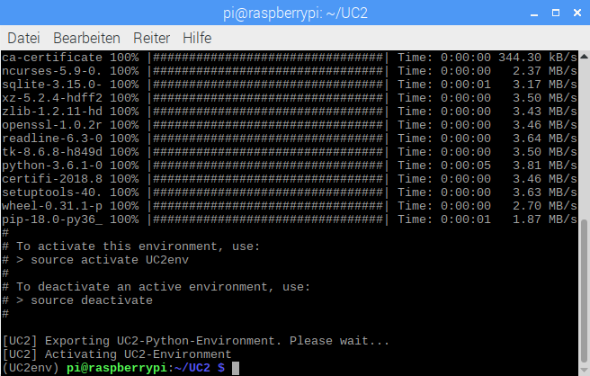

# Setting up Raspberry PI

## OUTLINE
* auto-gen TOC:
{:toc}

## Install and prepare RasPian 
1. Download ["Raspbian <NBR> with desktop"](https://downloads.raspberrypi.org/raspbian_latest), but without recommended software 
2. Flash raspian onto SD card by using e.g. [Win32DiskImager](http://sourceforge.net/projects/win32diskimager/files/latest/download) or [Etcher](https://www.balena.io/etcher/)
3. *Insert SD-card* into RasPi, start -> setup country info (Germany->German->Berlin->"Use English language"). Make sure, that your keyboard-input works as intended. Please find further information on how to setup RasPi on the [Official Homepage](https://www.raspberrypi.org/documentation/).
4. *Activate interfaces* and configure device. In a terminal enter `sudo raspi-config`, go to *Interfacing Options* and activate [SSH](https://www.raspberrypi.org/documentation/remote-access/ssh/), the [Picam](https://www.raspberrypi.org/documentation/configuration/camera.md) and (optional) the [I2C-interface](https://learn.adafruit.com/adafruits-raspberry-pi-lesson-4-gpio-setup/configuring-i2c). 
5. (OPTIONAL:) 
    If e.g. 7" Touch-Screen is used: rotating the Screen might be necessary. In a Terminal enter (for 2x90° rotation)
    ```
    $ sudo nano /boot/config.txt
    (append a new last line:)
    $ lcd_rotate=2
    $ sudo reboot now
    ```
6. *Fix date and time* manually if necessary. Download our [small FIX_date script](../../SCRIPTS/FIX_date/date_manfix.py) for ease of input and enter the date as suggested from commandline. If this does not work, the date can also be fixed directly in the terminal using: 
    ```
    $ sudo date -s "Tue Oct 30 16:07:41 CET 2018"
    ```
7. *Change username and disable root.* First, give a root passwd with `sudo passwd root`. <br\> Then, reboot into a shell so that no process of pi-user is already started on boot. Do: `sudo raspi-config`-> `boot options` -> `Desktop/CLI` (Raspi4) -> `boot console` -> `finish` -> `reboot`. After reboot, *login* as `root` and:
    ```
    $ usermod -l <your-uc2name> pi
    $ usermod -m -d /home/<your-uc2name> <your-uc2name>
    $ passwd <your-uc2name>
    $ logout
    (login as your new <your-uc2name>-User and, after connecting to internet, test:)
    $ sudo apt-get update
    (if it works, lock the root-account for safety, if it doesn't work and the file is still locked:)
    $ sudo passwd -l root
    $ sudo apt-get upgrade
    $ sudo reboot now
    ```
8. Change RasPi- and hostname:
    1. In `sudo nano /etc/hosts` change the last entry `127.0.0.1 raspberrypi` to  e.g. `127.0.0.1 UC2Pal01`, if it is your first raspberry in your group of setups. Save and exit. (Comment: do not change anything above the mentioned line!)
    2. Then `sudo nano /etc/hostname` and change the name to the same name as used above. Save and exit.
    
## Setup UC2-env for our GUI

For easy Python-environment handling, install the [Berryconda](https://github.com/jjhelmus/berryconda) derivate of [Anaconda](https://www.anaconda.com/). We prepared some convenient-scripts that you can download from our [SCRIPTS-section](../../SCRIPTS/SETUP_UC2env) to install Berryconda, setup a UC2env for development and activate it as standard.

### Disclaimer
By using this install script you agree to the following [license agreement](https://github.com/jjhelmus/berryconda/blob/master/LICENSE.txt) available in the following [repository](https://github.com/jjhelmus/berryconda).


### Installing
* Download all files of the [SCRIPTS-section](../../SCRIPTS/SETUP_UC2env)
For downloading with the command-line, just change the github-URL like shown below:

```
$ wget https://raw.githubusercontent.com/bionanoimaging/UC2-Software-GIT/master/SCRIPTS/00-UC2_Prerequisites.sh
$ wget https://raw.githubusercontent.com/bionanoimaging/UC2-Software-GIT/master/SCRIPTS/01-UC2_Berryconda.sh
$ wget https://raw.githubusercontent.com/bionanoimaging/UC2-Software-GIT/master/SCRIPTS/02-UC2_CreateEnvironment.sh
```
* After downloading all 3 files, make files runable
```
$ chmod +x 00-UC2_Prerequsities,sh 01-UC2_Berryconda.sh 02-UC2_CreateEnvironment.sh

```

* Run 00-UC2_Prerequisites.sh by typing into your terminal:
```
$ ./00-UC2_Prerequisites.sh
```
* wait until installation completes
* close current and open *new* terminal window
* check whether installation was successful by typing into new opened terminal window:
```
$ which conda
```
* you should see a directory as output
* if you get no output at all then something went wrong
* if everything's fine proceed by typing
```
$ source 02-UC2_Berryconda.sh
```
* your final terminal output should look like this (last line):



### Acknowledgements
Thanks to https://github.com/jjhelmus/berryconda for making Python 3.6 easily available for RaspberryPi.

## Installing Kivy 
* Make sure the conda **UC2env** env is **active**
```source activate UC2env``` 
* Install Kivy-dependencies as described within 1. and 2. bullet-point of [official Kivy-homepage](https://kivy.org/doc/stable/installation/installation-rpi.html) as preparation to use our GUI. 
* Then decide for building kivy on the system to get best performance with touch-screen and Window-provider even from within berryconda-environment. 
* Change to folder `cd ~/UC2/` and run: 
```
$ git clone https://github.com/kivy/kivy
$ cd kivy
$ python -m pip install --user .
```
Especially the installation of Cython and then building Kivy locally will take a while (>=60min, needed MEM<=500mb), so lean back and enjoy a coffee. Once Kivy is finished, configure the touch-screen of RasPi (if installed) as valid input-method. Hence, `nano ~/.kivy/config.ini`, search `[input]` and add `mtdev_%(name)s = probesysfs,provider=mtdev`.</br>
Comments:
- If you get the warning: *The scripts cygdb, cython and cyhonie are installed in '/home/YOURUC2NAME/.local/bin' which is not on PATH*, then try the following: 
    ```
    $ echo -e '#Adding Cython binary path to PATH' >> ~/.bashrc
    $ echo -e 'export "PATH="/home/YOURUC2NAME/.local/bin:$PATH"' >> ~/.bashrc
    $ source ~/.bashrc
    $ source activate UC2env
    ```
- installing Kivy with `$ python -m pip install --user -e .`, hence using option `-e`, leaves the installation editable if any small updates should be necessary to make the installation work on your device.
- for any further issues configuring kivy with RasPi-screen, check [this description](https://github.com/mrichardson23/rpi-kivy-screen).
- further comments appreciated? contact us :)

## Preparing and running our GUI
Prepare the UC2env (make sure it is active) by installing the following packages: 
```
$ conda install numpy matplotlib pyserial
$ python -m pip install unipath ruamel.yaml imageio safe-cast picamera smbus paho.mqtt
$ cd ~/UC2/
$ git clone https://github.com/bionanoimaging/UC2-Software-GIT.git
```


## Further Settings for sharing the finished (prepared) SDcard
Shrinking the size of the main partition (/dev/root) to make swapping between SDcards of different size (even if they are claiming to be 16GB the final size might differ by 1-500mb) or online easier is recommended. For our main-partition this cannot be done in-place (=while Raspbian is running), because the partition to be resized has to be unmounted. Hence, we suppose to using a boot media (e.g. USB-drive) with GPARTED on it. 
1. download [TUXBOOT](https://tuxboot.org/download/)
2. Create Bootable USB-drive by choosing GPARTED
3. Restart laptop, go to BIOS and boot from USB-drive
4. After LINUX came up: Mount SD-card and resize /dev/root partition to desired size (e.g. 6GB)
5. Test SD-card with RasPi
